<!-- markdownlint-disable MD033 -->
<!-- markdownlint-disable MD045 -->
# Redes y Sistemas Distribuídos


## Lab 3 : Transporte

Grupo 16 : Antonella Loyola, Carolina Yut, Gabriel Franicevich & Rodrigo Flores.

---

## ÍNDICE

- [Introduccion y objetivos](#introduccion-y-objetivos)
- [Métricas utilizadas](#métricas-utilizadas)
- [Parte 1](#parte-1---comprension-del-network)
    - [Modelo de colas](#modelo-de-colas)
    - [Casos de estudio](#casos-de-estudio)
    - [Análisis](#análisis)
- [Parte 2](#parte-2---tarea-diseño)
    - [Modelo de colas](#nuevo-modelo-de-cola)
    - [Casos de estudio](#nuevos-casos-de-estudio)
    - [Análisis](#análisis-parte-2)

- [Inteligencia Artificial](#consultas-a-la-ia)

---

### Introduccion y objetivos

En este informe estudiaremos diferentes escenarios de sistemas de control de flujo, en donde nos ayudaremos de Omnet++ (herramienta de modelado y simulación pública) basada en C++, que nos permitirá simular estos escenarios y también ver de manera gráfica los resultados de las métricas que usaremos (Tamaño del buffer, pérdida de paquetes,  etc).  
Durante la parte 1 estudiaremos el compartamiento del network y daremos un analisis detallado sobre lo que ocurre cuando tenemos congestiones dentro de la red;
Mientras que en la parte 2 modificaremos el diseño del network para tener otras "queue" personalizadas que nos permitiran medir el compartamiento en tiempo real e implementar modificaciones que mejoraran el desempeño de la red, evitara congestiones y evitara, en lo posible, tener perdidas de paquetes.

---

#### Métricas utilizadas

En los escenarios simulados analizamos las siguientes métricas:

- **Tamaño del buffer** (bufferSize): Cantidad de paquetes en la cola en un momento dado.
- **Pérdida de paquetes** (packetDrop): Número de paquetes descartados por desbordamiento del buffer.
- **Retraso promedio** (delay): Tiempo que tarda un paquete en llegar desde el origen hasta el destino.

Estas métricas fueron graficadas y analizadas en distintos escenarios configurando parámetros como la tasa de generación (generationInterval) y las capacidades de enlace.

---

## Parte 1 - Comprension del Network

#### Modelo de colas

El modelo que se ve en la siguiente imagen estaba incluido en el kickstarter, en donde se puede ver que consta de un generador, una cola y un destino conectados en una red Network.

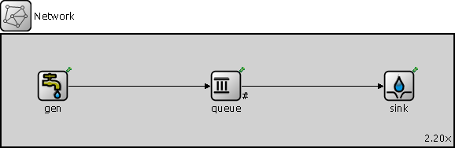

Los primeros escenarios de estudio no se haran sobre este Network, sino por el siguiente.

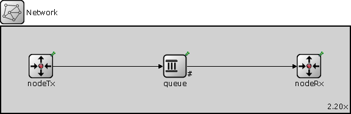

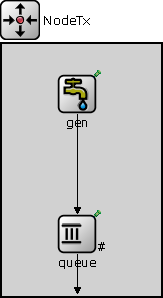 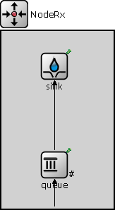

---

#### Casos de estudio

| Conexiones     | Caso 1         | Caso 2           |
|----------------|----------------|------------------|
| NodeTx a Queue | 1Mbps & 100us  | 1 Mbps & 100us   |
| Queue a NodeRx | 1 Mbps & 100us | 0.5 Mbps & 100us |
| Queue a Sink   | 0.5 Mbps       | 1 Mbps           |

#### Análisis

A lo largo de la explicacion vamos a nombrar con bastante redundancia el termino "saturar" para explicar que el buffer llego a su capacidad limite, estas "saturaciones" se generan a partir de que los paquetes de salida tienen una menor frecuencia de envio que los paquetes de entrada.

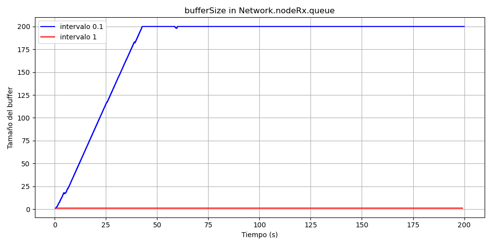

Este grafico nos muestra la cantidad de paquetes almacenados en el buffer de NodeRx.queue que nos permite observar dos casos generales.
El caso 1, que recordemos : 

```ned
//  network
NodeTx.out --> { datarate = 1mbps; delay = 100us } --> queue.in;
queue.out --> { datarate = 1mbps; delay = 100us } --> NodeRx.in;

// module NodeRx
queue.out --> { datarate = 0.5mbps } --> sink.in;

```

En donde vemos que teniendo el intervalo en 0.1 (generalInterval) el buffer se satura y en cambio con este intervalo en 1, el buffer no se satura. 

Conclusion : siendo el intervalo mas alto, genera que la cadencia de envios de paquetes sea mas baja permitiendo al buffer liberar estos paquetes sin lidiar con los problemas que genera la congestion dentro de nuestro network.

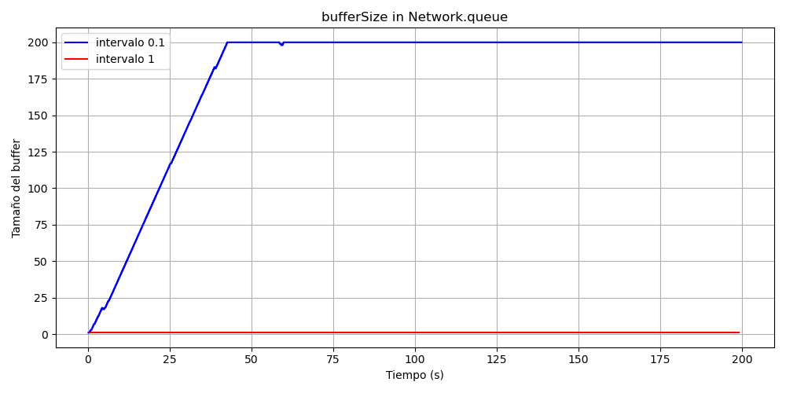

Analogamente sucede casi lo mismo en el caso 2, recordemos :

```ned
//  network
NodeTx.out --> { datarate = 1mbps; delay = 100us } --> queue.in;
queue.out --> { datarate = 0.5mbps; delay = 100us } --> NodeRx.in;

// module NodeRx
queue.out --> { datarate = 1mbps } --> sink.in;

```
Salvo que, ahora la "saturacion" se genera en el buffer de queue.

---

## Parte 2 - Tarea Diseño

#### Nuevo modelo de cola  

Los paquetes de datos siguen el flujo principal del sistema, atravesando los módulos en el siguiente orden:

- Gen → TransportTx → QueueMid → TransportRx → Sink.

En paralelo, se introdujeron paquetes de retroalimentación (feedback), fundamentales para implementar los mecanismos de control de flujo y congestión, que son controlados desde los módulos TransportTx y TransportRx.

Los paquetes de feedback atraviesan los módulos de la siguiente manera:

- TransportRx → QueueBack → TransportTx

De esta forma se permite tomar medidas de acuerdo al flujo que atraviesa el sistema.

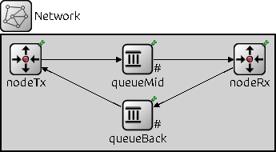

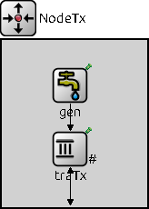 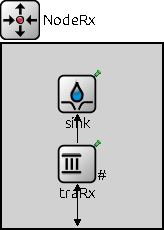

---

#### Nuevos casos de estudio


| Conexiones        | Caso 1         | Caso 2           |
|-------------------|----------------|------------------|
| NodeTx a QueueMid | 1Mbps & 100us  | 1 Mbps & 100us   |
| QueueMid a NodeRx | 1 Mbps & 100us | 0.5 Mbps & 100us |
| traRx a Sink      | 0.5 Mbps       | 1 Mbps           |

#### Análisis Parte 2

En la ejecuccion de estos dos casos, detectamos que el compartamiento es similar al network de la parte 1, exceptuando que ahora traTx y traRx actuan como esas "queue internas" que teniamos dentro de los nodos, tal que en el caso 1 (intervalo 0.1) la saturacion se presenta en el link traRx --> Sink y en el caso 2 (intervalo 1) esta se presenta en el link QueueMid --> NodeRx.

Para resolver la saturacion en el link traRx --> Sink, creamos un bool "next" que lo enviamos mediante un mensaje feedback al traTx.
Next se inicializa en true y solo cambia su valor en los momentos en el que buffer el buffer de traRx supera el 90% de su capacidad, esta señal le permite a traTx frenar momentaneamente el envio de paquetes aunque los sigue recibiendo, por lo tanto parte de la carga de estos paquetes comienzan a ocupar temporalmente espacio en el buffer de traTx. Esto permite que traRx siempre mantenga capacidad para recibir nuevos paquetes.

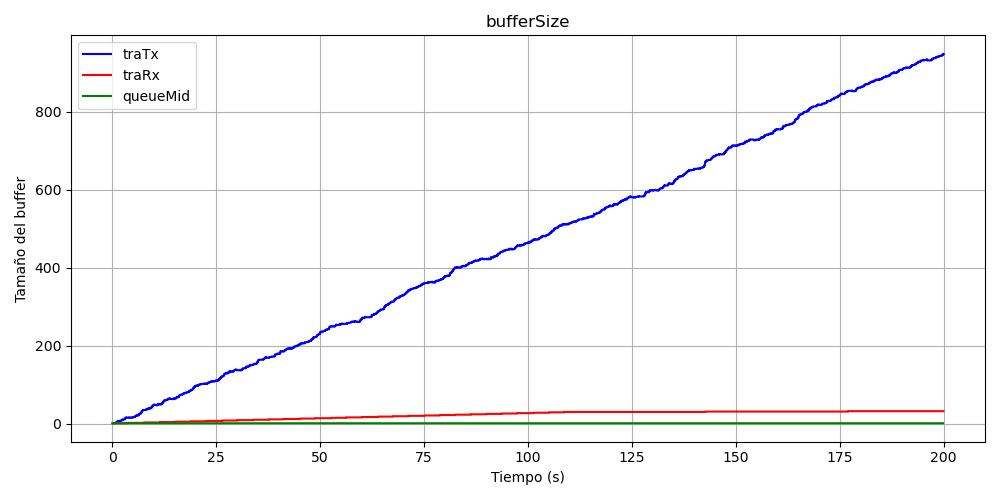

---

Y para el caso 2, teniamos la complicacion de que el "Next" del apartado anterior no nos podria funcionar, la solucion fue simple, un contador.
Este contador, packetSent, incrementa cada vez que traTx envia un paquete y decrementa cada vez que recibe un feedback. 
Nuestro algoritmo en TransportRx.cc envia un feedback a la vez que envia un cPacket a Sink, este metodo tiene sentido; Dado que este contador, en casos sin saturaciones, no deberia de alejarse mucho de su valor inicial ( 0 ).
Como queremos resolver casos con saturaciones, este contador nos servira para medir la cantidad de paquetes que enviamos y que traRx no esta recibiendo.

```c++
// aumento el retraso de la salida
if (packetSent > 30) {
    packetSent = 0; // reset
    delayOutput = delayOutput * 1.1;
}
```

Usamos "30" como un valor arbitrario y cada vez que se "acumulan" 30 paquetes que no llegaron a destino, la frecuencia de envio de traTx disminuye en un 10% dado que incrementamos su delay en ese porcentaje, esto permite ir ajustando la frecuencia de envio hasta llegar a un valor aceptable en donde los paquetes llegan sin problema.

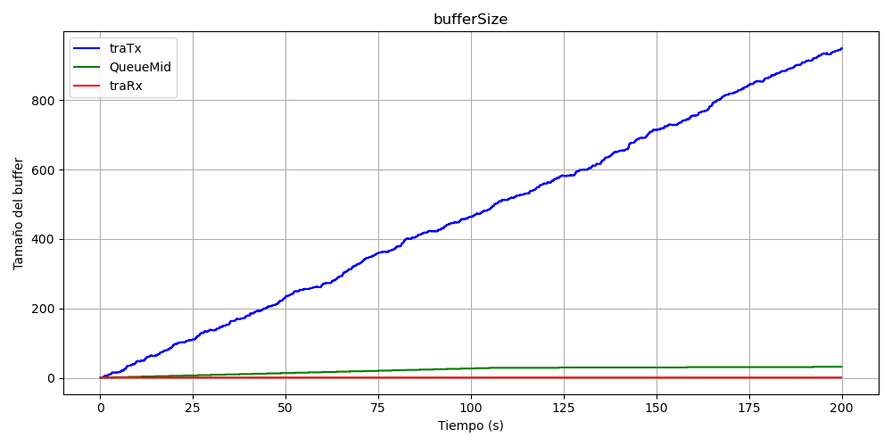

Conclusion : como se puede ver en ambos graficos, los buffers que antes se saturaban (traRx y queueMid correspondientemente) no llegan a su limite (200); por lo tanto siempre tienen capacidad de recibir paquetes entrantes.

---

Aclaracion, en el grafico de la parte 2 caso 1  donde se comparan los bufferSize se puede ver que el grafico es bastante similar al caso 2. Si la parte del contador “packetSent” no estuviese para el caso 1 y solo le damos uso a “Next” ahi si podriamos observar como el bufferSize de traRx llega a 180 ( 90% de su maximo).

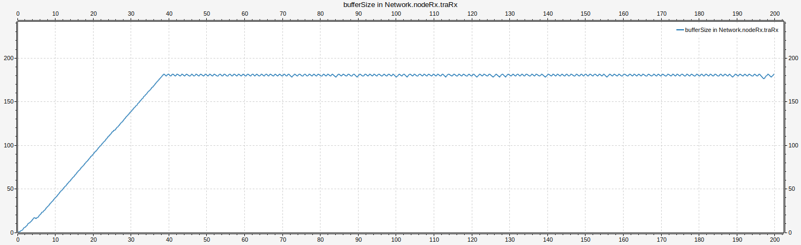

---

## Consultas a la IA

En general las consultas que hicimos a chatgpt fueron para entender las utilidades de omnet++, generar un algoritmo en python para poder graficar los .csv que obteniamos como resultado y por otro lado algunas, tambien relacionado con las funciones/metodos provenientes de oment++, preguntas nos la respondio gemini (IA integrada en las busquedas de google)

Ejemplos : 
    - Que retorna getDuration() en omnet++
    - Como podemos generar un mensaje que se vea en el red? Ej : packet drop

